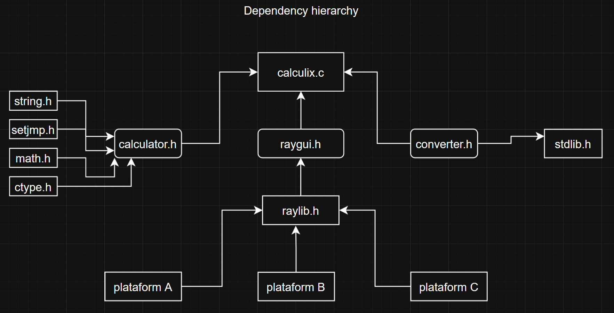

## CalculiX

### Description

CalculiX is a multi-platform calculator, available for macOS, Windows, Linux, Web, and Android. It is extremely efficient, lightweight, and runs natively in any environment, showcasing the full power of C.
The CalculiX calculator receives input data from the user as a string through a graphical interface. To return the result, the string passes through a chain of functions that, when analyzed individually, are simple, but together form a true production line that is, in a way, complex.
Each character in the analyzed string is passed through a conditional structure so that the program can identify the character and convert the entire string into a valid mathematical operation in C using the <math.h> library. The result is then obtained, converted back into a string, and returned to the graphical interface.

### Features

 -  Basic math operations 
 -  converts farenheit to celcius 

### Controls

 - Just hit the buttons 

### Screenshots
- 
- 
- 
### Links

 - [Raylib](https://github.com/raysan5/raylib)

### License

This project sources are licensed under an unmodified zlib/libpng license, which is an OSI-certified, BSD-like license that allows static linking with closed source software. Check [LICENSE](LICENSE) for further details.

$(Additional Licenses)

*Copyright (c) 2025 claudio ($(User Twitter/GitHub Name))*
